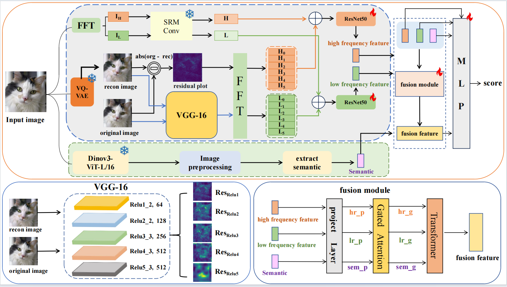

# MFF-Net-AI-generated-images-detection
## 📖Introduction
This repository contains the implementation of the paper: "MFF-Net: Multi-scale Feature Fusion Network for Universal AI-generated Image Detection"
### Abstract:
To improve generalization in synthetic image detection, we propose MFF-Net. It integrates seven high- and low-frequency feature groups (via VQ-VAE and VGG16 residual maps) with global semantic features from DINOv3 to capture both frequency anomalies and logical inconsistencies. These multi-source features are dynamically fused using a Gated Transformer encoder. Experimental results on AIGCDetectBenchmark and GenImage demonstrate state-of-the-art (SOTA) performance and robust generalization.

### 👀Method
We propose MFF-Net, a multi-scale fusion framework for universal synthetic image detection. The model employs a hybrid architecture that integrates high/low-frequency features (via image and residual maps) with global semantic features from DINOv3. These multi-source representations are fused through a Gated Attention Transformer within a multi-task learning framework. Finally, an adaptive inference strategy uses a confidence-based gating mechanism to select the most reliable prediction from both specialized experts and fused features.

<div align="center">
  
</div>

### 💻Requirments
We test the codes in the following environments, other versions may also be compatible:
* CUDA 12.1
* Python 3.10.18
* Pytorch 2.5.1

### 🛠️Setup
First, clone the repository locally.
```bash
git clone git@github.com:24842/MFF-Net-AI-generated-images-detection.git
```
Then, install the necessary packages and pycocotools.
```bash
pip install -r requirement.txt
```
### Dataset
Training set: [CNNspot](https://github.com/peterwang512/CNNDetection) and [GenImage](https://github.com/Andrew-Zhu/GenImage).

Test set: [AIGCDetectBenchmark](https://github.com/Ekko-zn/AIGCDetectBenchmark?tab=readme-ov-file), [GenImage](https://github.com/Andrew-Zhu/GenImage) and [Chameleon](https://drive.google.com/file/d/1QLYJMhy0CbBVT01BLkkw7KPPL5BpmxnH/view).

### Usage
#### Step 1: Feature Extraction
First, run the following scripts located in the tools directory to obtain high/low-frequency features, semantic features, and labels:
```bash
python tools/extract_feature.py
```
```bash
python tools/extract_semantic.py
```
```bash
python tools/make_lable.py
```
#### Step 2: Training
```bash
bash /scripts/train.sh
```
#### Step 3: Testing
```bash
bash /scripts/test.sh
```

### Checkpoints
Our training checkpoints can be downloaded from [link](https://pan.baidu.com/s/1zBYtDykr8PzE9ORoJg9lnA?pwd=mffn).


